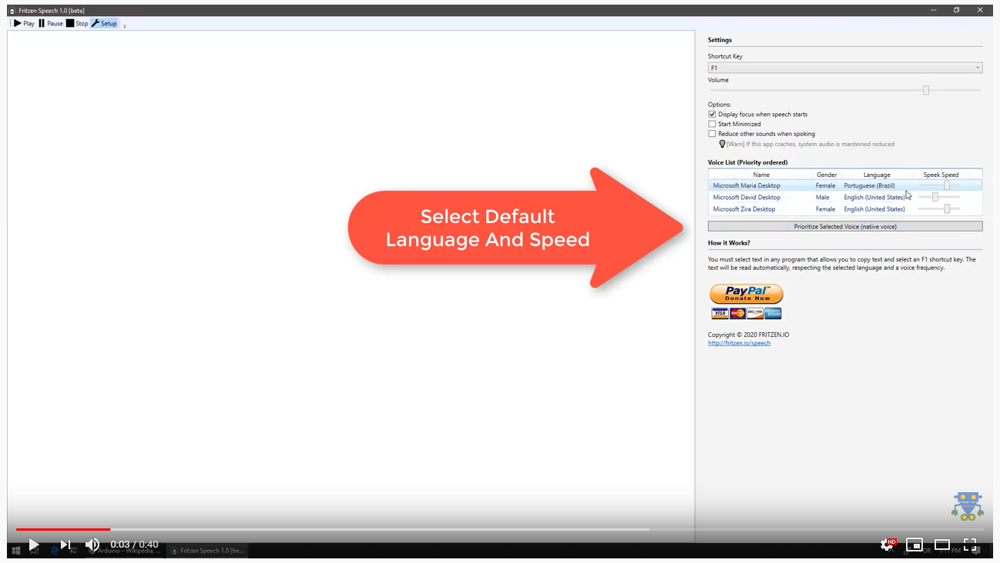

# fritzen-text-to-speech-app

This App aims to read selected text (works with any program that allows copy) with a fast shortcut key (F1 or CTRL + F1). The text will be read automatically, respecting the selected language and a voice speed.

See in action:

https://www.youtube.com/watch?v=GS6pRiegudw

