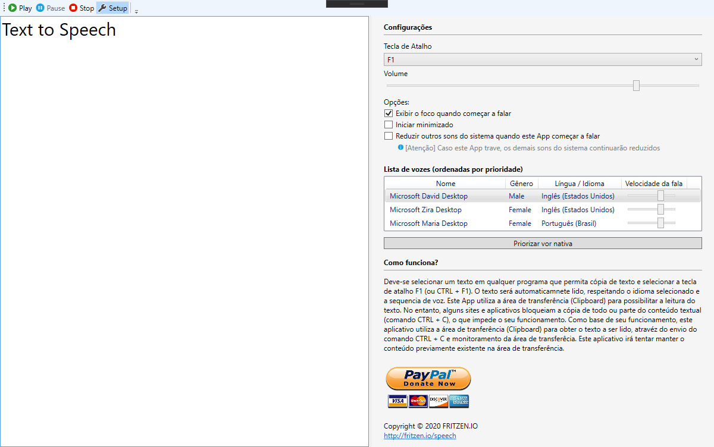

# fritzen-text-to-speech-app

This App aims to read selected text (works with any program that allows copy) with a fast shortcut key (F1 or CTRL + F1). The text will be read automatically, respecting the selected language and a voice speed.

# See in action

+ YouTube: 

  + https://www.youtube.com/watch?v=GS6pRiegudw

+ Windows Store

  + https://www.microsof t.com/en-us/p/fritzen-speech/9n48rdx75jrq?activetab=pivot:overviewtab

  

# How do Run?

1. Clone

2.  Open ``FritzenSpeech.sln`` with Visual Studio Community 

3. Press ``F5`` to run

   

# External Libs

+ NTextCat.TextCat Language Models
+ Newtonsoft.Json
+ AudioSwitcher.AudioApi

